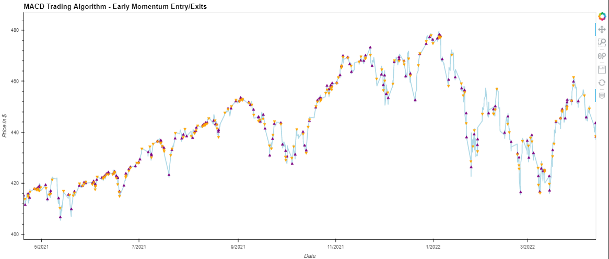
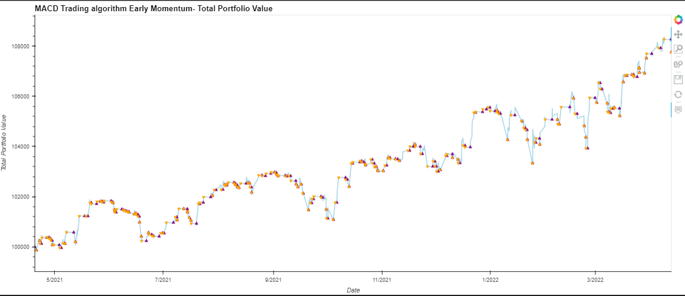
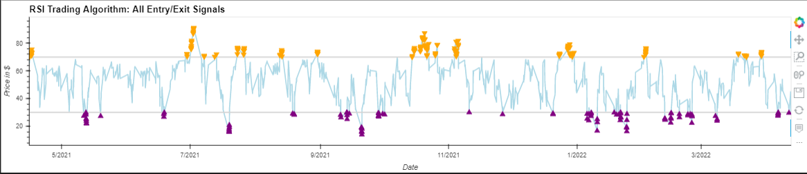
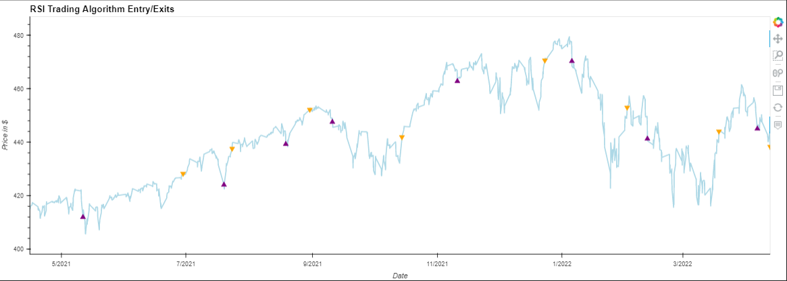
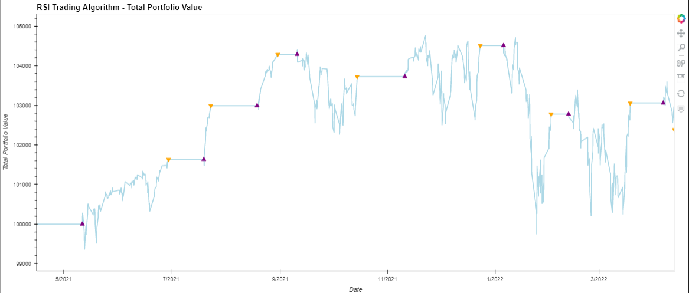
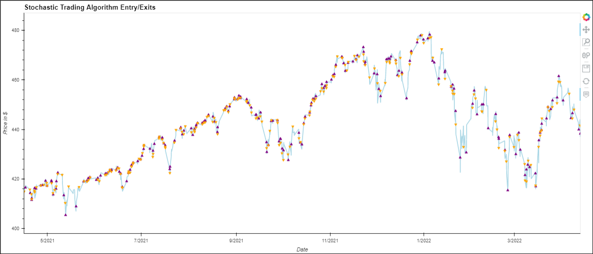
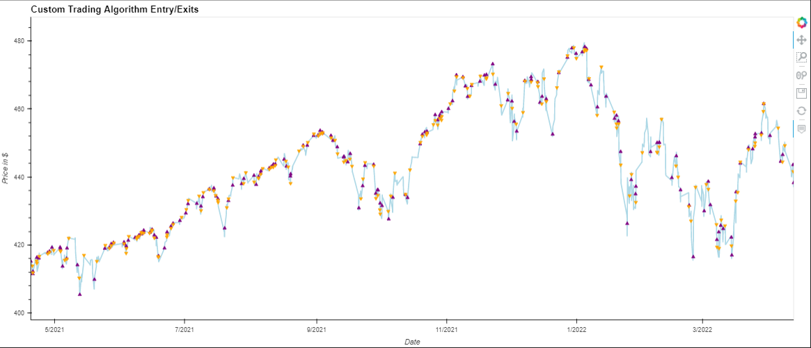
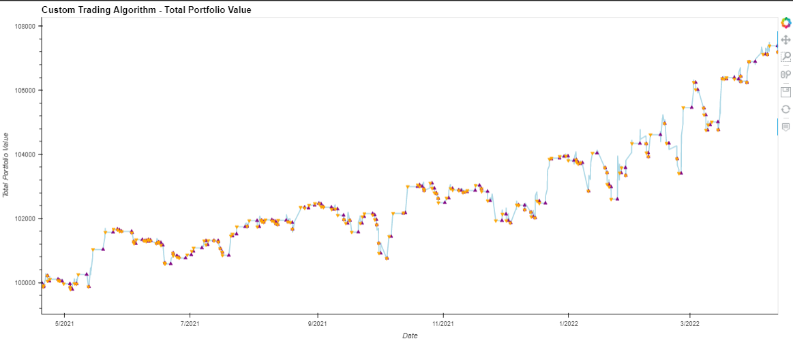

# **Project 2:** ~~Wall~~ **Easy Street Machine Learning Algorithm**

## **Overview of the Analysis**

*  We are endeavoring to build a trading algorithm that will outperform a buy and hold strategy for the S&P 500, and evaluate whether or not this program could be used for trading alternative asset classes that are correlated to the equity markets like crypto. Using a dataframe consisting of one year hourly S&P 500 data, the analysis first creates signals using MACD, RSI, Stochastic, and a custom (combination of MACd and Stochastic indicators) technical indicators. The applicable training and test data is then exported to a csv that feeds two machine learning modules in the team's second jupyter notebook. 

* The questions we set out to answer are:
  1) What technical indicators create the most consistent profit trading?
  2) How can machine learning improve the technical trading algorithms and which model performs the best?
  3) Can an algorithm trained and tested on equities data be re-used for crypto data?
## Easy Street User Guide: Steps for Reperformance
  **Step 1:** Use YahooFinance library to import one year of hourly S&P500 trading data. The algorithm and machine learning mechanisms utilized herein take up quite a bit of space and can easily crash a jupyterlab instance when collated into one notebook. Given this, the team segregated outputs and datasets into separate notebooks and csv files starting with the [initial S&P500 data saved in the Resources folder.](https://github.com/Kevinator9000/Group2_Project2/blob/main/Resources/spy.csv)  
  The one year S&P500's performance in the spy.csv file is visualized here:

   * S&P Cumulative Returns Over a One Year Period
    
  * S&P Price per Share Over One Year

       

**Step 2:** Navigate to the folder titled 'algorithms' and open any one of the jupyter notebooks. Use Pandas Technical Analysis (ta) library to bring in MACD, RSI, and Stochastic technical indicators. Apply the technical indicators to the S&P500 Close prices - when applied, each indicator generates a value that is appended to its own column in the dataframe. The team created its own custom indicator consisting of MACD and Stochastic - this is the team's fourth inidicator also housed in its own notebook.

**Step 3:** Create signals & Entry/Exit position. Each technical indicator requires a strategy, the logic of which is assigned and appended to the dataframe in separate columns. The model and end user need to be able to ascertain the current position, buy/sell/hold signal, and total portfolio value - the logic for these datapoints are coded into each indicator notebook. Each entry/exit signal is applied to the close price and assumed number of shares held to evaluate each indicator's performance (profit/loss). Each indicator's resulting dataframe is exported to a csv file in the Resources folder and used for machine learning models' training data. **The most profitable indicator strategy is the custom MACD/Stochastic algorithm**.

**Step 4:** Run the indicator algorithms through machine learning models and understand which combination of the two performs best. Each indicator's machine learning notebook is located in the same directory as this README. The team tested the algos with logistic regression, random forest, and a neural network and concluded that, for the team's needs, **the best machine learning model is a neural network**.

**Step 5:** Can the algos and machine learning models utilized with S&P500 data be used with BTC? Yes! Apply the custom indicator algorithm to BTC in the machine learning notebook titled 'bitcoin_ml'. The custom algo and neural network outperforms BTC by 16%!

## Results

* MACD Indicator:
  
    * MACD Early Entry Exit

       
  * MACD Early Value

    

* RSI Indicator:
    * RSI Signals

       
  * RSI Entry Exits

    

  * RSI Value

    

* Stochastic Indicator:
  * Stochastic Entry Exit

    
  * Stochastic Value

    
 

* Custom Indicator: Generated the most profit!
    * Custom Entry Exit
  
       
  * Custom Value
  
    

* Machine Learning Results:
  * Logistic Regresssion - Custom Indicator

    
  * Random Forest - Custom Indicator

    
  * Neural Network - Custom Indicator: The Winning Combo!

    
  * ML 4th Visualization

     

## Summary

* The answers to our questions:
  1) What technical indicators create the most consistent profit trading? An indicator entailing MACD and Stochastic strategies performs best.
  2) How can machine learning improve the technical trading algorithms and which model performs the best? A neural network is the best machine learning model evaluated by the team. Using OneHotEncoder enables a neural network to capture all categorical features (in addition to the numeric ones) which improves its prediction capabilities.
  3) Can an algorithm trained and tested on equities data be re-used for crypto data? Yes! A neural network driven by the team's custom technical indicator algo outperformed BTC by 16%.

